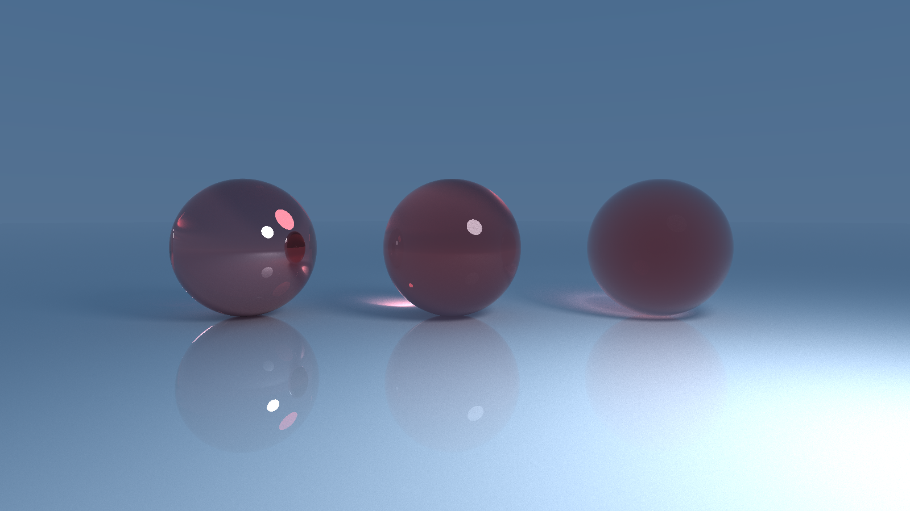
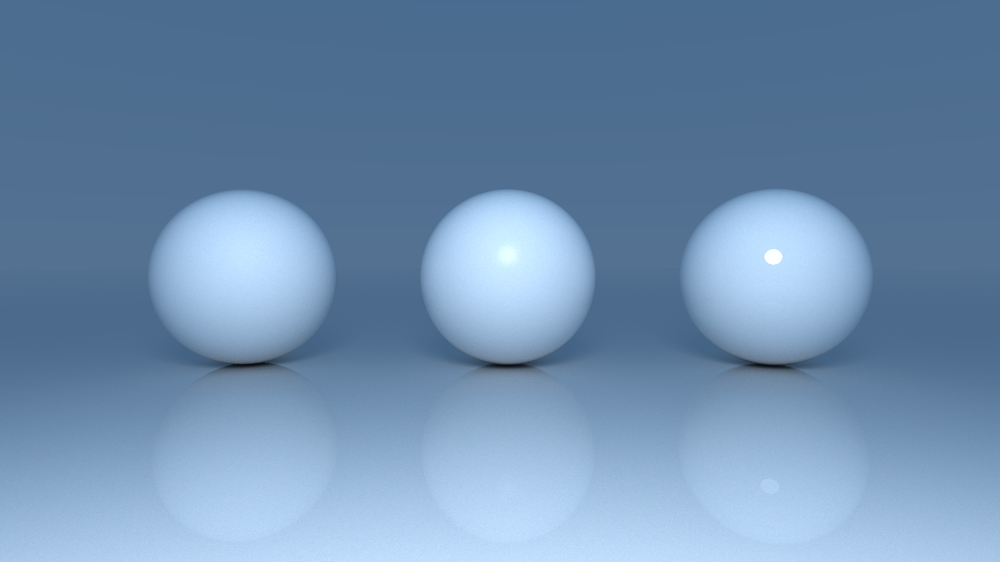
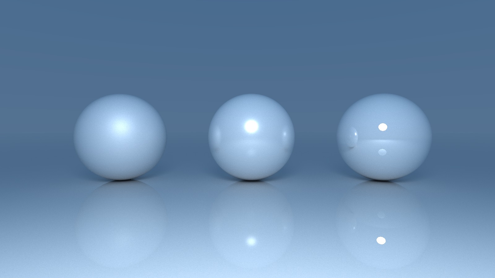
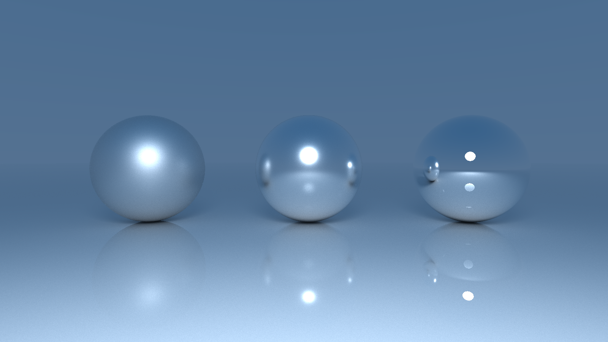
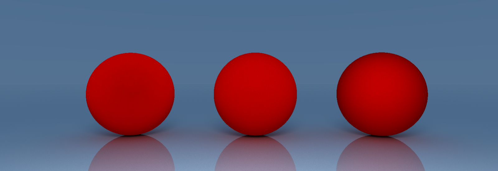
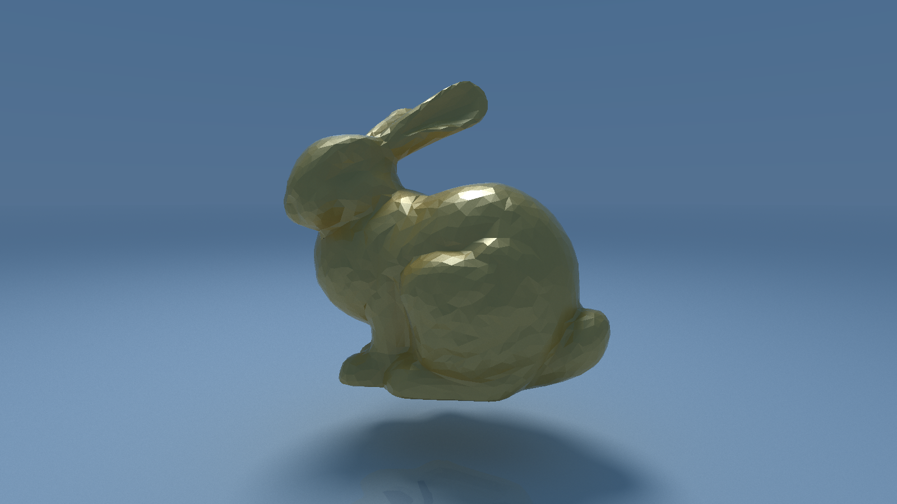
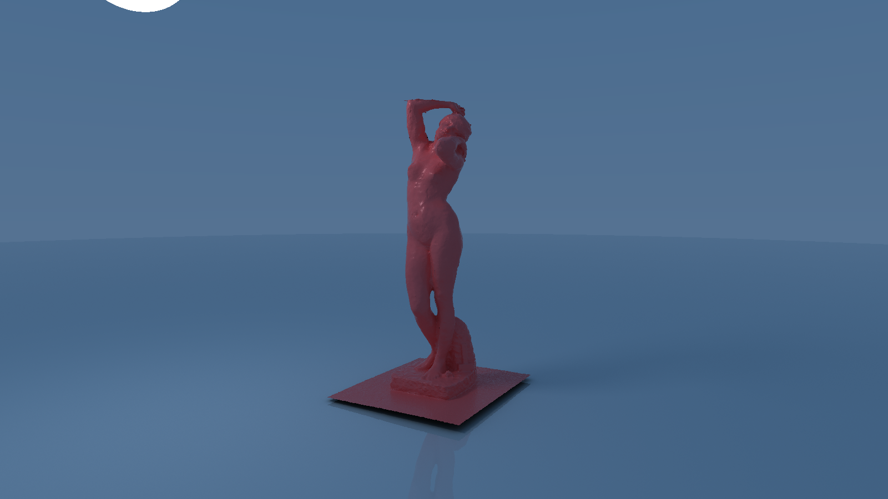

## Overview

[📄 See the PDF report of the project](outputs/Rendu%20Projet%20IGR.pdf)

### App showcase

### Dielectrics with Fresnel-Schlick

### Glossy and Metals with Cook-Torrence and GGX

### Rough Diffuse with Energy-Preserving Oren-Nayar (EON)

### Other

